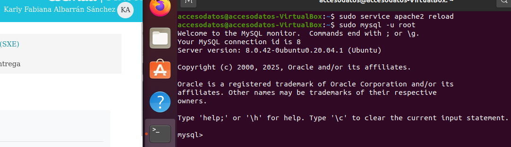

# Guia paso a paso para instalar y configurar WordPress

---
## ⚙️ _Paso 1: Instalar dependencias necesarias_
Comenzamos actualizando la lista de paquetes del sistema e instalando todo el *software* 
necesario, incluyendo el servidor web Apache, MySQL y las extensiones de PHP requeridas por
WordPress.
```bash 
sudo apt update
```
Instalar el servidor web y paquetes PHP/MySQL: 

```bash 
sudo apt install apache2 \ 
    ghostscript \ 
    libapache2-mod-php \ 
    mysql-server \ 
    php \ 
    php-bcmath \ 
    php-curl \ 
    php-imagick \ 
    php-intl \ 
    php-json \ 
    php-mbstring \ 
    php-mysql \ 
    php-xml \ 
    php-zip 
   wget \
 ```

---
# 🛠️ _PASO 2: Instalar WordPress_
 ```Para este paso utilice los siguientes comandos: ```
``` sudo mkdir -p /srv/www ```
```sudo chown www-data: /srv/www ```
```curl https://wordpress.org/latest.tar.gz | sudo -u www-data tar zx -C /srv/www ```


# _PASO 3: Configurar Apache_
con ``` sudo nano /etc/apache2/sites-available/wordpress.conf ``` cree el archivo de configuración de Apache para WordPress y añadí lo siguiente:
``` 
<VirtualHost *:80>
DocumentRoot /srv/www/wordpress
<Directory /srv/www/wordpress>
Options FollowSymLinks
AllowOverride Limit Options FileInfo
DirectoryIndex index.php
Require all granted
</Directory>
<Directory /srv/www/wordpress/wp-content>
Options FollowSymLinks
Require all granted
</Directory>
</VirtualHost> 
```

`Luego habilité el sitio: `
```sudo a2ensite wordpress ```

`Para habilitar la reescritura de URL: `
```sudo a2enmod rewrite```

`Desactivar el sitio predeterminado de "Funciona" con:`
```sudo a2dissite 000-default```

`Finalmente reinicié Apache para aplicar los cambios:`
```sudo service apache2 reload```


# _PASO 4: Creamos la BD MySQL_
`Para este paso ingresé a MySQL con:`
```sudo mysql -u root```

`Ya dentro de MySQL, creé la base de datos, el usurio y le di permisos con los siguientes comandos:`
```CREATE DATABASE wordpress
```CREATE USER wordpress@localhost IDENTIFIED BY '<vboxuser>';
``` GRANT SELECT,INSERT,UPDATE,DELETE,CREATE,DROP,ALTER ON wordpress.* TO wordpress@localhost;
``` 
`Y para guardar los cambios/permidos que le hemos dado al usuario usamos:`
```FLUSH PRIVILEGES;```
`para salir de MySQL:`
```EXIT;```


# _PASO 5: Configurar WordPress_
`para configurar WordPress, primero debemos copiar el archivo de configuración de muestra:`
```sudo -u www-data cp /srv/www/wordpress/wp-config-sample.php /srv/www/wordpress/wp-config.php```
`establecemos credenciales de bd en el archivo de configuracion con los siguientes comandos:`
```sudo -u www-data sed -i "s/database_name_here/wordpress/" /srv/www/wordpress/wp-config.php```
```sudo -u www-data sed -i "s/username_here/wordpress/" /srv/www/wordpress/wp-config.php```
```sudo -u www-data sed -i "s/password_here/<vboxuser>/" /srv/www/wordpress/wp-config.php```


`y finalmente  abrimos el archivo de configuracion en nano:`
```sudo -u www-data nano /srv/www/wordpress/wp-config.php```
`En este punto tenemos que editar ciertas lineas:`
``` define( 'AUTH_KEY',         'put your unique phrase here' );
define( 'SECURE_AUTH_KEY',  'put your unique phrase here' );
define( 'LOGGED_IN_KEY',    'put your unique phrase here' );
define( 'NONCE_KEY',        'put your unique phrase here' );
define( 'AUTH_SALT',        'put your unique phrase here' );
define( 'SECURE_AUTH_SALT', 'put your unique phrase here' );
define( 'LOGGED_IN_SALT',   'put your unique phrase here' );
define( 'NONCE_SALT',       'put your unique phrase here' );
```
`Las borramos y las reemplazamos por las sigueintes: `
```
define('AUTH_KEY',         'vs)^Da8Gw8%lW/4 Pgt{T1MXQv8}M(5U3:ork8CV] P+Y@USl5Iv-B~u9bNJezJ2');
define('SECURE_AUTH_KEY',  'hNSYdEmO;5$W,xK|8UOl-8r6?n1*F-wocTNmP$URhItc|j]s8^-|^@@Dj&Z_o3-%');
define('LOGGED_IN_KEY',    'M&qXNx.-2V*+)/_riB&s4<Q|E#Rz4+]7,ghO&Q~9cW7hG5QE[u(NBT!g~ nO/c8e');
define('NONCE_KEY',        ']dT`27>EZ?q`nx,@D$[P9)p/!kB:|B)x@+^eh3}VS@4Ldl}-xZ?9[2Lnv::_Wv9d');
define('AUTH_SALT',        'b.qG3^:tD,CA:yx>bA>s3E4pG;}^A?c@+A4#-!Nn%8&N,.^:,fPl2iZWI1#bE2C>');
define('SECURE_AUTH_SALT', '} Mt?I@|:Lb~?L{01pRs.] Nthg9j0ni#:%sY-TFK0T%&S}4o#4{nth7+iW*++4H');
define('LOGGED_IN_SALT',   'n,q2J6SZ&I6bNXj++})?oO||i|Cy=7O{J|V^vQc=t}VfRa4l}AFh<2v|C`)#(-k-');
define('NONCE_SALT',       'Uo0Z9N0hpy_L+>n@+P>Asf]i}5ls!;>ebT:72;7(_;J23-Bu#gr7>,7CRWkjQy[@');
```


# _PASO 6: Finalizar la instalación a través del navegador web_
`ingresamos a la siguiente URL en el navegador web: `
```http://localhost/``` `en la que tenemos que introducir el nombre dle sitio, que en mi caso es "WordPress Karlyn", el nombre de usuario "Karly", la contraseña "vboxuser"
y el correo electronico "kalbarransanchez@danielcastelao.org" (el de clases). Presionamso en "Instalar WordPress" y listo, ya tenemos nuestro WordPress instalado y funcionando.`


`Accedemos`


`Ya dentro del WordPress podemos ver el panel de administración y editar a nuestro gusto.`
 
`contamos con muchas opciones para personalizar nuestro sitio web. como el estilo de la letra, insertar imagenes como lo he hecho yo, cambair colores y más... en mi caso solo me limite a cambiar cosas basicas, solo para entender un poco como funciona WordPress.`


